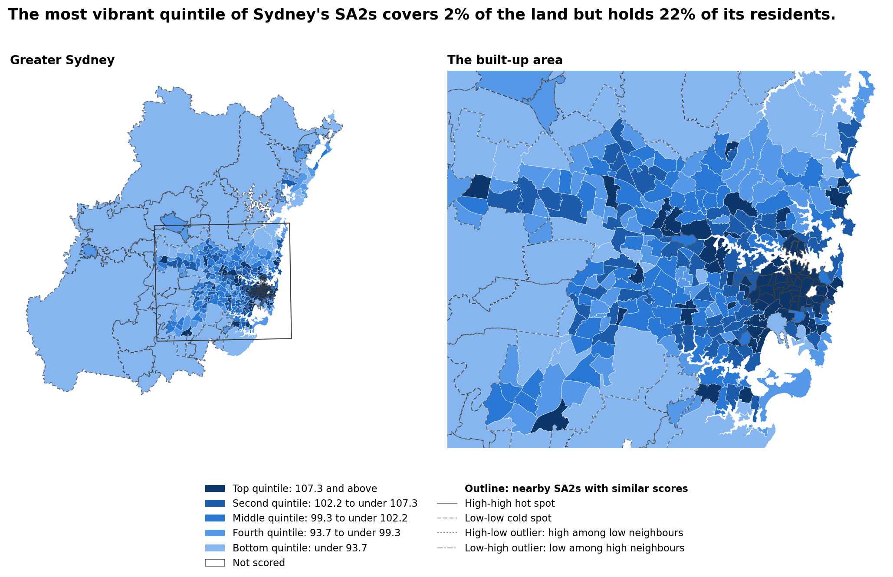

# Vibrancy index for Greater Sydney

Which Greater Sydney SA2s have the conditions associated with lively, varied, walkable areas, and how much can that
ranking be trusted? This project builds a vibrancy index for the 373 Greater Sydney SA2s (ASGS Edition 3, 2021) from
public data, and tells the result as a data story.

The index is a proxy. It measures the conditions that allow street activity, from open data on businesses, residents,
transport, streets and land use. It does not measure how many people are actually there.

## Overview

- **The question.** Which parts of Greater Sydney have what lively, varied, walkable streets usually need: people living
  nearby, businesses and services, public transport, a mix of uses and a connected street network?
- **The areas.** The unit is the SA2, a statistical area drawn by the Australian Bureau of Statistics. An SA2 is usually a
  suburb or a few suburbs joined together, and Greater Sydney has 373 of them.
- **The score.** For each SA2 we measured 14 things (the indicators) in three groups (the pillars): Intensity (how much is
  packed into the area), Diversity (how varied the mix of businesses and land uses is) and Design (how connected the streets
  are). We put them on a common scale and averaged them. A score of 100 is the Greater Sydney average, and 10 points is a
  typical spread. The SA2s are then ranked and split into five equal groups called quintiles.
- **What it is for.** It is a screening tool: it points to places worth a closer look. It is not a count of people on the
  street, and it does not say which areas are better to live in.
- **What it cannot do.** Individual ranks move when the method changes, the data has gaps, and the check against real walking
  counts covers only 16 inner-city SA2s. The page has a Limitations section and a Next steps section that say this in detail.

**Status.** The data pipeline is built and tested: it downloads 15 sources, then cleans, checks and loads them into
PostGIS as 17 data tables, plus two tables for source records and quality checks. The vibrancy index (fourteen indicators in three pillars), its checks and the data story page are
built and tested too. The methodology book in `vibrancy/book/` is still being written.

## Results

The numbers below come from the saved results and the built page. They are screening results for the conditions that
allow street activity, not measurements of how busy places are.



*Vibrancy score by quintile: the whole region (left) and the built-up area (right). Thin outlines mark clusters of similar
scores: solid for high-high hot spots and dashed for low-low cold spots. The two kinds of outlier have dotted and dash-dot
outlines.*

- **What was scored.** 372 of the 373 SA2s get a score. Centennial Park has no residents or registered businesses, so it
  is left out. The most vibrant quintile of the scored SA2s (75 areas) covers 2.0% of the land that was scored but holds
  22.4% of its residents.
- **Who lives in the most vibrant places.** Residents of higher-income areas are about twice as likely to live in a
  top-quintile SA2 as residents of lower-income areas (31.8% against 16.1%). The income groups are areas, not households, so
  this describes areas and not individual households.
- **How sure we can be.** The top group is fairly stable: the top 25 SA2s keep 17 to 25 of the same SA2s across the 22
  alternative versions of the index (for example dropping one indicator, skipping the log transform or weighting every
  indicator equally). Individual ranks are not stable: the median SA2 moves 71 places between its best and worst rank
  across the versions.
- **Nearby places look alike.** SA2s next to each other tend to have similar scores (global Moran's I 0.55, p = 0.001,
  from 999 random shuffles, so 0.001 is the smallest p-value the test can give). 35 SA2s are in high-high clusters and 47
  are in low-low clusters. The page shows them as a filled hot-spot layer on the map and as a scatterplot of each SA2's
  score against the average score of its neighbours. The clusters are descriptive: no correction is made for testing many
  areas.
- **Four kinds of place.** Splitting the SA2s by density and diversity gives four place types: dense and diverse (126
  SA2s), dense and less diverse (91), less dense and diverse (80) and less dense and less diverse (75). An SA2 is
  dense when the mean of its Intensity and Design scores is at or above 100, and diverse when its Diversity score is at
  or above 100.
- **A weak check against walking counts.** Measured walking counts exist for only 16 inner-city SA2s, and all of them rank
  1 to 29 of 372. The scores and the counts are at best weakly related (Spearman correlation 0.31 for weekday counts and 0.17
  for weekend counts). So the check can only test the ordering among the busiest places, and it is weak evidence.
- **The limits.** The index is a proxy for conditions that can support street activity, not a measure of how busy places
  are, and it uses registered businesses, which are mostly home-based. The page has a Limitations section, with pictures,
  in plain language. In short: the check against real walking counts only covers the top of the ranking; the cluster labels
  are not corrected for running many tests (about 19 of the 372 tests could look special by chance alone, as a rough guide);
  the pillars have equal weights by choice, with Intensity covering ten indicators and Diversity and Design two each; the
  inputs come from different years (2021 to 2026); and SA2s differ a lot in size. None of this shows cause.
- **Next steps.** The page also lists next steps, one for each limitation: shopfront-level business data, jobs and floor-area
  data, one reference year for all inputs, finer areas, walking counts from outside the inner city, a false discovery rate
  correction for the clusters, other weights, and rank ranges instead of single ranks. These are ideas to test, and we do not
  know yet whether they would change the ranking.

## View the story

**Live page:** <https://juanvu1810.github.io/Vibrancy-score-analysis-for-Greater-Sydney/vibrancy/index.html>

The data story is also the page [vibrancy/index.html](vibrancy/index.html) in this repository, so you can open the file
directly in a browser without visiting the link above. It
has a map you can click, charts, a sortable table and what-if tools (change the pillar weights, or pick one of the 22
alternative versions). The map needs an internet connection, because the map library (Leaflet) loads from a CDN. The map
has no background tiles by design, so it shows the SA2 shapes only.

The page starts with a short "what this page shows" card that defines the main terms. A contents list (beside the page on a
wide screen, folded at the top on a narrow one) links to every section. The page ends with how the score was built
(including a table of the 14 indicators and the equations), the limitations, the next steps and a glossary.

On the page you can:

- switch the map between six layers: the overall score, the three pillars (Intensity, Diversity and Design), the four place
  types and the hot spots. The legend shows the quintiles, the place types or the clusters, with counts;
- zoom to Greater Sydney, the inner city, Parramatta or Liverpool, and show or hide the thin hot-spot outlines;
- search for an SA2 by name and open its profile card: score, rank, how far its rank moves across the 22 alternative
  versions, the three pillar bars, everyday facts (residents, businesses, stops and street intersections), its hot-spot
  class and its neighbours' average score;
- hover over a dot on a chart to highlight that SA2 on the map, and click it to open its card;
- sort the table by any column, filter it by name and download it as a CSV file;
- try your own pillar weights, or pick any of the 22 alternative versions, and see how the map and the ranks change;
- switch between a light and a dark theme;
- use the page on a phone.

## The data

| Publisher | What | Licence |
|---|---|---|
| Australian Bureau of Statistics | SA2 boundaries, counts of businesses by industry, personal income, regional population, Census mesh block counts | CC BY 4.0 |
| Transport for NSW | Timetable stops (GTFS), traffic light locations | CC BY |
| NSW Department of Education | School intake zones (catchments) | CC BY |
| NSW Spatial Services | Health facilities (hospitals) | not verified |
| Australian Electoral Commission | Polling places, 2025 federal election | not verified |
| OpenStreetMap contributors | Public toilets and drinking water, pedestrian crossings, the walkable road network, everyday shops | ODbL |
| City of Sydney | Trees, stairs and mobility parking (inner city only), and pedestrian count sites (inner city only, kept for checking the index) | CC BY 4.0 |

Every file is recorded in `raw/manifest.json` with its URL, retrieval time, size and SHA-256, and the ETL refuses a file
that does not match. A fresh download gives newer numbers over time, so keep the manifest with any results you publish.
The details of each table, and the known limits of each source, are in [etl/README.md](etl/README.md).

## Run it yourself

You need [Docker](https://docs.docker.com/get-docker/) with Compose, about 5 GB of free disk space (the two Docker images are
2.2 GB and `raw/` is 2.1 GB), and a connection that can download about 750 MB. It was developed on Docker Desktop for Windows with the WSL 2 backend; run the commands
below from a WSL, Linux or macOS terminal.

```bash
cp .env.example .env          # first time only. This overwrites an existing .env, so skip it if you have one
# edit .env (not .env.example) and set DB_PASSWORD to a private password
docker compose build etl      # first time, and whenever requirements.lock changes
docker compose run --rm --no-deps --user "$(id -u):$(id -g)" --entrypoint python etl download_data.py   # step 1
docker compose run --rm etl   # step 2: unzip, clean, check, and load into schema "vibrancy"
```

Step 1 saves every source under `raw/` (it skips what is already there and carries on after a cut-off connection).
Step 2 reads only `raw/`, checks each file against its checksum, and writes the cleaned tables to `staging/` and to the
`vibrancy` schema of the PostGIS database that Docker Compose starts. Both folders are git-ignored. Unzipping the downloads is
what takes `raw/` to about 2 GB.

- **Optional key.** A free Transport for NSW API key (register at <https://opendata.transport.nsw.gov.au>) makes the
  timetable download more reliable. Put `TFNSW_API_KEY=...` in your private `.env`, never in `.env.example`.
- **The database** is published on `127.0.0.1:5433`, so it cannot be reached from other machines. User, database and
  port can be changed in `.env`.
- **Where the checks are.** `staging/data_quality_report.csv` lists the result of every check as PASS, WARNING or FAIL.
- **Tests.** `docker compose run --rm --no-deps --entrypoint python etl -m pytest tests -q`
- **More options.** Running one source, loading into a PostgreSQL server you already have, starting again from scratch,
  and viewing the tables in pgAdmin are in [etl/README.md](etl/README.md).
- **As a notebook.** [etl_walkthrough.ipynb](etl_walkthrough.ipynb) runs the same pipeline one explained stage at a time.

### Run the analysis

The analysis reads the `vibrancy` database that the ETL step above filled, so run that first. Then run these from the same
terminal and folder. The database container must be running (`docker compose up -d db` starts it).

```bash
# 1. Run the notebook: indicators, score, checks and further analyses. It writes its results to output/
docker compose run --rm --user "$(id -u):$(id -g)" -e PYTHONDONTWRITEBYTECODE=1 -e MPLCONFIGDIR=/tmp/matplotlib --entrypoint bash runner -c \
  "jupyter nbconvert --to notebook --execute vibrancy_index.ipynb --output-dir output --output vibrancy_index.executed.ipynb --ExecutePreprocessor.kernel_name=python3 --ExecutePreprocessor.timeout=-1"

# 2. Build the story page and its static figures from those results
docker compose run --rm --no-deps --user "$(id -u):$(id -g)" -e MPLBACKEND=Agg -e PYTHONDONTWRITEBYTECODE=1 --entrypoint python runner scripts/build_vibrancy_story.py --out vibrancy

# 3. Run the tests
docker compose run --rm --no-deps --entrypoint python etl -m pytest tests -q
```

- **Order matters.** `output/` is git-ignored, so a fresh clone must run step 1 before step 2: the page is built from the
  files in `output/`. The notebook is saved with its outputs, so you can read the results without
  running it; step 1 writes a fresh executed copy to `output/vibrancy_index.executed.ipynb`. On the author's machine step 1 took about 40 seconds and step 2 about 10.
- **What each step writes.** Step 1 only reads the database and writes files to `output/`. Step 2 rewrites
  `vibrancy/index.html` and the figures in `vibrancy/images/`. Neither step writes to the database.

### Build the methodology book

The book in [vibrancy/book/](vibrancy/book/) is a [Jupyter Book](https://jupyterbook.org) 2 site (Python 3.9 or newer).
The first build asks to download Node.js, which Jupyter Book needs, and installs it beside the package.

```bash
cd vibrancy/book
pip install -r requirements.txt
jupyter-book build --html      # the site is written to vibrancy/book/_build/html
```

## Files

| Path | Purpose |
|---|---|
| `download_data.py` | Downloads every source into `raw/` and records it in `raw/manifest.json` |
| `etl/` | Unzips, cleans, checks and loads the downloads (`python -m etl run`); its README describes every table |
| `etl_walkthrough.ipynb` | The pipeline as an explained notebook |
| `vibrancy_index.ipynb` | The analysis, one explained step per cell: the fourteen indicators, the score, the checks and the further analyses (place types, hot spots, income, walking counts) |
| `index_tools.py` | The index functions (entropy, standardised scores, assigning points and polygons to SA2s, the street intersection count, place types, Moran's I), each with a small test |
| `scripts/build_vibrancy_story.py`, `scripts/vibrancy_story_template.html` | Build the story page and its static figures from the files in `output/` |
| `output/` | The generated results (git-ignored): the scores, the checks, the further analyses and the executed notebook |
| `vibrancy/index.html`, `vibrancy/images/` | The data story page and its static figures |
| `vibrancy/book/` | The methodology book (in progress); the rest of `vibrancy/` is the story page above |
| `tests/` | Tests for the downloader, the unzipping, the parsers, the quality checks, the index functions, the saved score table and the saved hot-spot table |
| `docker-compose.yml`, `Dockerfile` | The PostGIS database and the Python environment |
| `requirements.txt`, `requirements.lock` | The direct dependencies, and a full pin of every package (the Docker image installs the lock file) |
| `.env.example` | Template for the private `.env` |

## Credits and licences

- OpenStreetMap data is © [OpenStreetMap contributors](https://www.openstreetmap.org/copyright), available under the
  Open Database Licence (ODbL), which has share-alike terms for a derived database.
- The boundaries and statistics are © the Australian Bureau of Statistics. Transport for NSW, NSW Government and City
  of Sydney data are used under their open data licences, as in the table above.
- The AEC and NSW Spatial Services licences were not confirmed. Check each licence before you reuse or redistribute
  the data.
