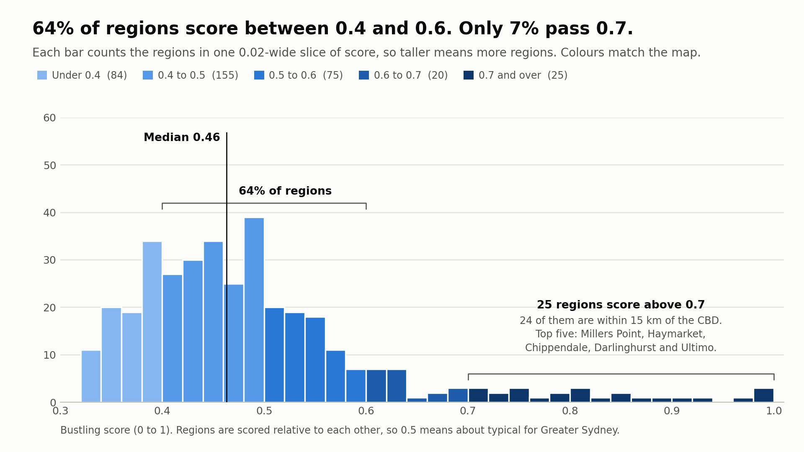
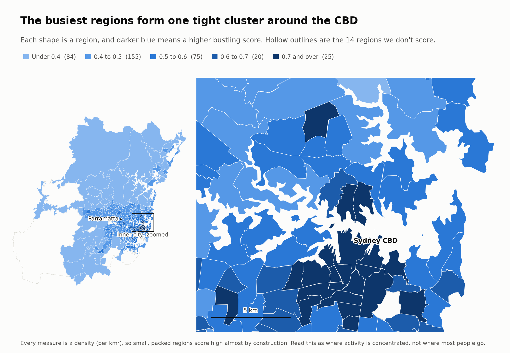
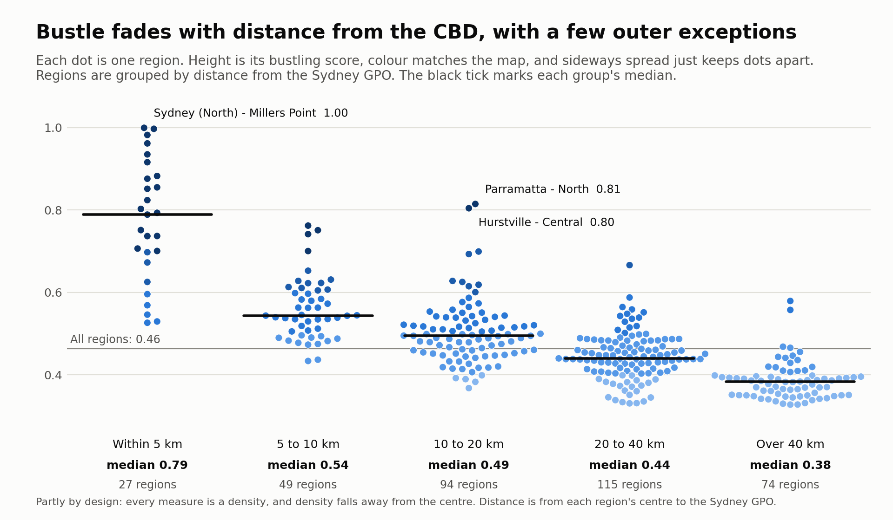
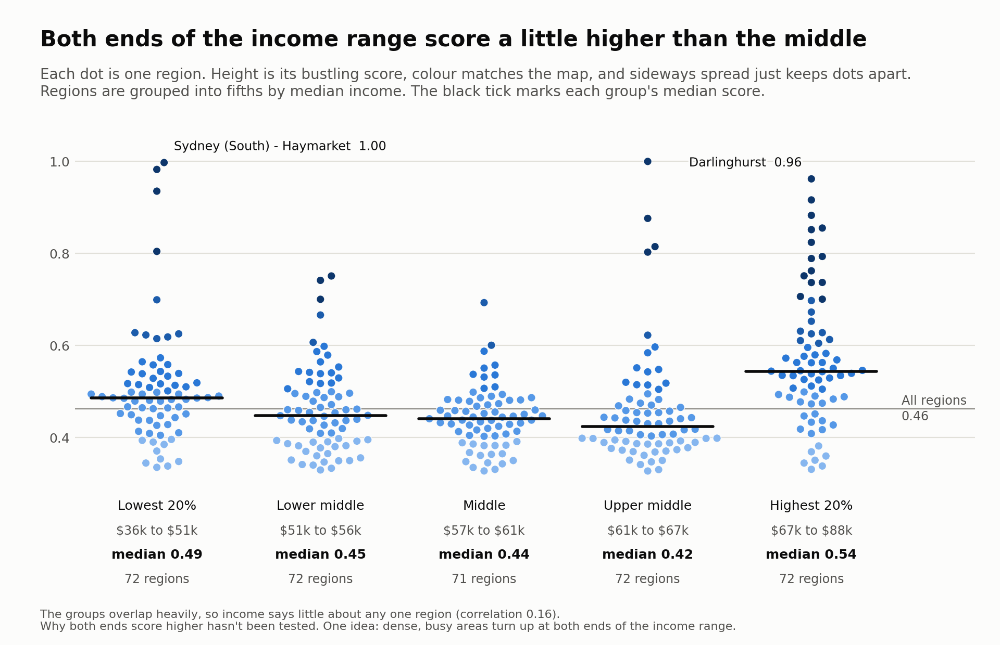

# Bustling score for Greater Sydney

This is an independent data science project built so that anyone can re-run it and get the
same numbers.

It scores every SA2 region in Greater Sydney from 0 to 1 for how "bustling" it is. It combines
seven measures of everyday activity (transport stops, polling places, businesses, schools,
traffic lights, public amenities and pedestrian crossings), each counted per square kilometre,
into one number per region.

This README is the write-up: the data we used, how it's stored, how the score works, what came
out, and where the method is weak. The last section shows how to re-run everything yourself.
The analysis itself lives in [`bustling_score.ipynb`](bustling_score.ipynb).

**Interactive story (map, charts and a table of every region):** <https://juanvu1810.github.io/Bustling-score-analysis-for-Greater-Sydney/>

## The short version

- 359 of Greater Sydney's 373 SA2 regions are scored. The other 14 have 100 or fewer people
  aged 0 to 19 and are left out.
- The inner city comes out on top: Sydney (North) - Millers Point (0.9996), Sydney (South) -
  Haymarket (0.9971), Chippendale, Darlinghurst and Ultimo. The lowest is Warragamba -
  Silverdale (0.3277).
- Most regions sit in the middle. The median is 0.46, 64% of regions score between 0.4 and 0.6,
  and only 25 score above 0.7.
- Bustle is packed into a small core. Those 25 regions take up about 0.5% of the area we scored,
  and 24 of them are within 15 km of the CBD. The median score is 0.79 within 5 km of the CBD and
  0.38 beyond 40 km.
- Income doesn't explain the score. The correlation is small (0.158, with a 95% bootstrap
  interval of 0.02 to 0.29). When we rank the regions first it's 0.079 with an interval that
  crosses zero, so it's comparable to no link at all. Average scores are higher at both the low
  and high ends of the income range than in the middle, which a straight-line measure can't
  pick up.
- **The big caveat:** a score is relative. 0.5 means "about average for Greater Sydney's
  regions", not "moderately busy" in any absolute sense.

## Who might use this

If you work in a council or on transport planning, this gives you a quick view of which areas
already have a lot going on per square kilometre. That could help when you're deciding where
lighting, toilets, crossings or extra services should go. If you're weighing up where to open a
café or a shop, it could be a rough first filter for which areas to look at. SA2s are generally
the smallest areas the Australian Bureau of Statistics (ABS) uses for its non-Census statistics
([ABS](https://www.abs.gov.au/statistics/standards/australian-statistical-geography-standard-asgs/edition-3-july-2021-june-2026/main-structure-and-greater-capital-city-statistical-areas/statistical-area-level-2)),
so the scores line up with a lot of other official data you might want to combine them with.

It isn't a footfall forecast. Nothing here has been checked against real pedestrian counts (see
[Limitations](#limitations)), so treat it as a screening tool, not as evidence of how many
people are actually out and about. And because the score rewards places that already have lots
of stops, shops and amenities per km², it's better at showing where things are busy than where
something is missing.

## Contents

1. [The data](#the-data)
2. [The database](#the-database)
3. [How the score works](#how-the-score-works)
4. [Results](#results)
5. [Limitations](#limitations)
6. [Run it yourself](#run-it-yourself)
7. [Credits and licences](#credits-and-licences)

## The data

Everything is in this repository, so nothing needs downloading. Ten datasets go into the
project. Nine of them feed the score; the income data is only used for the comparison in
[Results](#bustling-score-and-median-income). Where the retained source metadata identifies a
publisher, it is linked here. Several files do not record their original publisher, so this
project says that instead of guessing.

**SA2 boundaries** (`SA2_2021_AUST_GDA2020.*`). Polygons for all 2,473 SA2 regions in
Australia (2021 edition), with each region's name, codes and area in km². SA2s are
medium-sized areas built to represent communities that interact socially and economically,
usually with 3,000 to 25,000 residents
([ABS](https://www.abs.gov.au/statistics/standards/australian-statistical-geography-standard-asgs/edition-3-july-2021-june-2026/main-structure-and-greater-capital-city-statistical-areas/statistical-area-level-2)).
The file's own metadata names the ABS as its publisher and describes it as part of the
Australian Statistical Geography Standard (ASGS). We kept the 373 regions in Greater Sydney
and stored every polygon as a MultiPolygon in SRID 4326.

**Businesses** (`Businesses.csv`). 12,217 rows counting businesses by industry (19 industries)
and annual turnover band, for 643 NSW SA2 regions. The only change was renaming `sa2_code` to
`SA2_CODE21` so it matches the other tables. The retained file does not record its original
publisher.

**Income** (`Income.csv`). Earners, median age, and median and mean income for 642 NSW SA2
regions. We renamed the code column and replaced `np` ("not provided", 28 cells) with NULL.
The retained file does not record its original publisher.

**Population** (`Population.csv`). People by five-year age band, for the 373 Greater Sydney
regions only (not all of NSW). We renamed the code column. In the database we add a
`young_people` column (ages 0 to 19), which drives the schools measure and the region filter.
The retained file does not record its original publisher.

**Public transport stops** (`Stops.txt`). 114,718 stop records for the whole of NSW, in the
GTFS `stops.txt` format
([GTFS reference](https://github.com/google/transit/blob/master/gtfs/spec/en/reference.md)).
About half of them (53,991) have `location_type` 1, which GTFS defines as a station, meaning a
structure that contains platforms. The rest are stops or platforms. We renamed the coordinate
columns and turned them into points. The retained file does not record its original
publisher.

**Polling places** (`PollingPlaces2019.csv`). 2,930 polling places for the 2019 federal
election, all in NSW, published by the Australian Electoral Commission
([AEC](https://www.aec.gov.au/elections/federal_elections/2019/downloads.htm),
[data.gov.au](https://data.gov.au/data/dataset/au-govt-aec-aec-federal-election-polling-places-2019-na)).
140 rows have no coordinates (for example, multi-site hospital teams), so they can't be placed
on the map. We dropped `the_geom` and `premises_state_abbreviation` (which repeats `state`)
and built points from latitude and longitude.

**School catchments** (`catchments_primary.*`, `catchments_secondary.*`, `catchments_future.*`).
Polygons for 1,662 primary, 436 secondary and 30 "future" catchments. We stacked primary and
secondary into one table, and where a school (`USE_ID`) also has a future catchment, the
future one takes priority. We dropped columns we didn't use (`PRIORITY`, `KINDERGART`,
`YEAR1` to `YEAR12`, `ADD_DATE`). The retained files do not record their original
publisher.

**Traffic lights** (`traffic-lights-location-data-may-2021.csv`). 4,325 signal records across
NSW as of May 2021, from Transport for NSW on
[Data.NSW](https://www.data.nsw.gov.au/data/dataset/2-traffic-lights-location). By asset type
that's 3,867 vehicle signals, 452 pedestrian signals and 6 "re-active maintenance" records. We
count all of them, and keep only the suburb and the location.

**Public amenities** (`public_amenities.geojson`). 6,595 OpenStreetMap points: 4,053 public
toilets and 2,542 drinking water points, exported with
[Overpass turbo](https://overpass-turbo.eu/). We kept the geometry only. The export date isn't
recorded.

**Crossings** (`crossings.geojson`). 1,825 OpenStreetMap points, also exported with Overpass
turbo. Every one is tagged `crossing=zebra`, so this is zebra crossings only, not every
pedestrian crossing in NSW. Pedestrian signals probably show up in the traffic lights file
instead (that's where the 452 pedestrian signals above come from).

The datasets come from different years (polling places 2019, SA2 boundaries 2021, traffic
lights May 2021, and unrecorded dates for the rest), so the score is a blend, not a snapshot
of one moment.

## The database

We loaded everything into PostgreSQL with the PostGIS extension, using one coordinate system
(SRID 4326) so the spatial joins line up. The notebook writes out each table's schema.

| Table | What it holds | Notes |
|---|---|---|
| `sa2_boundaries` | Greater Sydney regions (MultiPolygon) | Primary key `SA2_CODE21`, spatial (GiST) index |
| `schools` | School catchment polygons | Primary, secondary and future combined |
| `businesses`, `income`, `population` | Tables from the CSV files | `income` is indexed on `median_income`; `population` gains `young_people` |
| `stops`, `polling_places`, `public_amenities`, `crossings`, `traffic_lights` | Points | Each gets an `SA2_CODE21` column |

The score is built from derived tables: `stops_per_sqkm_per_sa2`, `polls_per_sqkm_per_sa2`,
`schools_per_sa2`, `businesses_per_1000`, `public_amenities_per_sqkm_per_sa2`,
`crossings_per_sqkm_per_sa2` and `traffic_lights_per_sqkm_per_sa2`, all feeding `bustling_scores`.

Each point is assigned to a region with `ST_Contains`
([PostGIS docs](https://postgis.net/docs/ST_Contains.html)). One quirk: PostGIS doesn't count
a point lying exactly on a region's boundary as contained, so such a point wouldn't be assigned
to any region. We haven't counted how many that affects, and we'd expect very few.

## How the score works

$$
\text{Score} = S\left(\frac{z_\text{business} + z_\text{stops} + z_\text{polls} + z_\text{schools} + z_\text{traffic lights} + z_\text{public amenities} + z_\text{crossings}}{7}\right)
\qquad S(x) = \frac{1}{1 + e^{-x}}
$$

In plain steps:

1. Measure seven things per region, each per km² (table below).
2. Turn each measure into a [z-score](https://en.wikipedia.org/wiki/Standard_score): subtract
   the average across the scored regions and divide by the standard deviation. That puts all
   seven on the same scale.
3. Average the seven z-scores.
4. Pass the average through the [logistic (sigmoid) function](https://en.wikipedia.org/wiki/Logistic_function),
   which squeezes any number into the range 0 to 1.

We average before applying the sigmoid on purpose. Adding more z-scores inside it would push
scores towards the extremes of 0 and 1 (a region that's high on everything would just pile up
near 1), and averaging avoids that while still rewarding regions that are high across the
board. We added traffic lights, public amenities and crossings on top of the original four
measures because, in theory, more inputs should give a fairer picture. We haven't been able
to test whether it actually does, since we have no ground truth to compare against.

Only regions with more than 100 people aged 0 to 19 are scored. That removes very small
populations and keeps the schools measure from producing wild outliers when a region has
almost no children.

| Measure | How it's calculated | Why we included it |
|---|---|---|
| Businesses | Weighted count of businesses per 1,000 residents per km²: Retail Trade x 0.30, Arts and Recreation Services x 0.20, Accommodation and Food Services x 0.50 | Retail is one of the largest in-person customer industries. Arts and recreation (concerts, events) brings foot traffic. Hotels, bars and restaurants are what we thought contributed most to bustle, so they got the biggest weight. |
| Transport stops | Stops per km² | More movement, more bustle. |
| Polling places | Polling places per km² in the tables, but see [Limitations](#limitations) | Polling places tend to be put where people already travel (an assumption we haven't checked). |
| Schools | School catchments that intersect the region, per 1,000 young people, per km² | Schools are busy places. Catchments were the data we had, and the count is divided by young people because regions differ in how many students they have. |
| Traffic lights | Signals per km² | Lots of signals suggests heavy traffic movement, even though a single set doesn't mean much. |
| Public amenities | Toilets and drinking water points per km² | Public toilets and fountains tend to appear where lots of people walk (also an assumption). |
| Crossings | Zebra crossings per km² | Crossings tend to sit where there's pedestrian movement. |

Why per km²? Regions differ a lot in size. With raw counts, large regions looked busy just
because they had more room for stops, while small, dense regions that seem obviously bustling
got low scores. Dividing by area turns each count into a density.

The industry weights (30/20/50) are our own judgement calls, not fitted to anything, and the
seven measures are weighted equally. These are the assumptions most open to argument.

## Results

### Distribution



**How to read it:** each bar counts the regions in a 0.02-wide slice of score, so a taller bar means
more regions. The black line is the median: half of the regions score higher and half score lower.

- The median is 0.46 and the mean is 0.49. The middle half of regions sits between 0.41 and
  0.53, and 64% score between 0.4 and 0.6.
- The tallest bar (39 regions) is at 0.48 to 0.50, so the peak really is close to 0.5.
- Most regions bunch up just under 0.5, with a long, thin tail stretching towards 1. That shape
  is called [right-skewed](https://en.wikipedia.org/wiki/Skewness), and the skewness here is
  about 1.7. Only 25 regions (7%) score above 0.7, and just 14 score above 0.8.
- Nothing scores below 0.33. That floor is probably a side effect of the method, not a finding.
  These density measures are very lopsided: lots of low values and a few huge inner-city ones.
  A region can't fall far below the average, but the top end has no such limit. (The lowest
  average z-score in the data is about -0.7 and the highest is about +7.7.)

Scores are relative, so "most regions are middling" is partly built in: an average z-score of
zero turns into exactly 0.5. This histogram tells you more about how spread out Greater
Sydney's regions are than about how lively they are in absolute terms.

The bars use the same five classes as the map below, so the chart doubles as its key. We chose the
breaks (0.4, 0.5, 0.6 and 0.7) to spread the colours over where the regions actually are. The
earlier map used five equal bins of 0.2, and 87% of regions (314 of 359) fell into just two of its
colours.

### Map

[](https://juanvu1810.github.io/Bustling-score-analysis-for-Greater-Sydney/)

(Click the image for the interactive version.)

**How to read it:** each shape is one region, and darker blue means a higher score. The small map on
the left is all of Greater Sydney. The large one on the right is the boxed inner city, enlarged
because the busiest regions are small.

The busiest regions form one tight cluster around the CBD. The 25 regions above 0.7 take up about
0.5% of the area we scored and hold about 6% of its residents. At the scale of the whole city that
cluster is a speck, so the figure zooms in on the inner city, where the small regions are. The
interactive page has the same zoom, plus hover tooltips and a table of every region. We use one
blue, light to dark, in place of the earlier green-to-red scale, which colour-blind readers
struggle with and which cast busy places as "danger". Hollow outlines are the 14 regions we don't
score.

Regions near the CBD are the darkest, and the outer edges are the palest. That's what you'd
expect, but it's partly built in: every measure is a density, so dense inner areas have more
stops, businesses, lights and crossings per km² almost automatically. So the map tells you more
about density than about anything else, and it can't say whether an outer region has one busy
town centre surrounded by quiet land. If you're using it to decide where a council should add
services, remember that it points at places that already have lots of them, not at the gaps.

| Highest | Score | Lowest | Score |
|---|---|---|---|
| Sydney (North) - Millers Point | 0.9996 | Warragamba - Silverdale | 0.3277 |
| Sydney (South) - Haymarket | 0.9971 | Cobbitty - Bringelly | 0.3278 |
| Chippendale | 0.9822 | Ourimbah - Fountaindale | 0.3299 |
| Darlinghurst | 0.9618 | Terrey Hills - Duffys Forest | 0.3307 |
| Ultimo | 0.9351 | Bayview - Elanora Heights | 0.3312 |

### Distance from the CBD



**How to read it:** each dot is one region. Its height is its bustling score and its colour matches
the map. Regions are grouped by distance from the CBD, and the sideways spread inside a group only
stops dots overlapping, so it means nothing. The black tick is each group's median, and the thin
grey line is the median of all regions (0.46).

Bustle fades steadily with distance from the CBD. The median score is 0.79 for the 27 regions
within 5 km of the Sydney GPO (Martin Place), 0.54 at 5 to 10 km (49 regions), 0.49 at 10 to 20 km
(94), 0.44 at 20 to 40 km (115) and 0.38 beyond 40 km (74). Two regions break the pattern by
scoring above 0.7 more than 10 km out: Parramatta - North (0.81, about 20 km away) and Hurstville -
Central (0.80, about 14 km).

Distances run from the centre of each region to the GPO, measured in a metric projection (MGA zone
56). This is a descriptive cut, not a test, and much of it is built in: every measure is a density,
and density falls away from the centre. So it shows that the score behaves like a density, not that
the CBD itself causes bustle.

### Bustling score and median income

Do busier regions have higher incomes? Not in a way that's easy to see. The correlation between
bustling score and median income is **0.158** (Pearson). Resampling the regions 10,000 times
gives a 95% bootstrap interval of about 0.02 to 0.29
([bootstrapping](https://en.wikipedia.org/wiki/Bootstrapping_%28statistics%29)), so the link is
positive but small, and it could be close to nothing.

The rank-based version
([Spearman](https://en.wikipedia.org/wiki/Spearman%27s_rank_correlation_coefficient)), which
only cares about the order of the regions and not the exact values, is **0.079**, with an
interval of about -0.04 to 0.19. That interval crosses zero, so on this measure the link is
comparable to no link at all. A permutation test (shuffling incomes across regions) points the
same way: p is about 0.003 for Pearson and 0.13 for Spearman. Reading the two together, we'd
call it a small positive link at best. Squaring the Pearson figure gives 0.025, so the score
accounts for roughly 2.5% of the differences in income between regions. You can reproduce all
of this with `python scripts/income_correlation.py`.

Why so weak? The pattern isn't a straight line. Here is every region as a dot, split into five
equal-sized groups by median income:



**How to read it:** each dot is one region. Its height is its bustling score and its colour matches
the map. Regions are grouped into fifths by median income, and the sideways spread inside a group
only stops dots overlapping, so it means nothing. The black tick is each group's median score, and
the thin grey line is the median of all regions (0.46). The scale is the same as the distance chart
above, so the two are easy to compare.

The same groups as numbers:

| Median income group | Median income | Regions | Average score | Median score |
|---|---|---|---|---|
| Lowest 20% | $36k to $51k | 72 | 0.507 | 0.487 |
| Lower middle | $51k to $56k | 72 | 0.462 | 0.448 |
| Middle | $57k to $61k | 71 | 0.444 | 0.441 |
| Upper middle | $61k to $67k | 72 | 0.457 | 0.424 |
| Highest 20% | $67k to $88k | 72 | 0.569 | 0.544 |

Both ends score higher than the middle, by average and by median, and a correlation coefficient
can't see a U shape. It's a shallow one, though: every group has regions near the bottom of the
range (about 0.33), so the gaps between the groups are small next to the spread inside each one.
That fits a weak link. A plausible explanation, which we haven't tested, is that busy, dense areas turn up at both ends
of the income range: affluent inner-city areas such as North Sydney - Lavender Bay and
Woollahra, and lower-income areas with busy town centres such as Haymarket, Auburn and
Lakemba. Here are the five highest-income and five lowest-income regions:

| Region | Median income | Bustling score |
|---|---|---|
| Lilyfield - Rozelle | 88,220 | 0.569 |
| Balmain | 87,932 | 0.529 |
| Erskineville - Alexandria | 87,640 | 0.596 |
| North Sydney - Lavender Bay | 85,147 | 0.855 |
| Woollahra | 84,677 | 0.698 |
| ... | ... | ... |
| Auburn - North | 39,571 | 0.615 |
| Wiley Park | 39,550 | 0.519 |
| Lakemba | 39,413 | 0.565 |
| Auburn - Central | 38,824 | 0.514 |
| Sydney (South) - Haymarket | 35,875 | 0.997 |

Haymarket is the most extreme case: the lowest median income of all 359 regions and the
second-highest score. Other things probably play a part too, such as tourist attractions, big
transport hubs, universities and events. The measures here count things in a place, not the
incomes of the people who live there. We haven't tested any of these ideas.

If you were hoping to use one of these as a stand-in for the other, don't. A retailer using the
score to guess where spending power is, or a council using income to guess where the crowds
are, would get a lot of regions wrong.

## Limitations

Here's where the method holds up, where it's a judgement call, and where it doesn't match what
it says on the tin.

### What holds up (checked, and passing)

- **It reproduces.** A fresh run matches the original results to within 1e-16 (see
  [Run it yourself](#run-it-yourself)). We got the same numbers on PostGIS 3.4 (the Docker
  image) and PostGIS 3.5 (a separate non-Docker test), so the result doesn't depend on that
  version.
- **The checker can fail.** We tampered with a score, dropped a row and changed a reference
  value on purpose, and it caught all three.
- **Nothing is missing.** All 359 scored regions have a value for every measure, with no empty
  cells.
- **The published map is the real result.** Its 359 embedded scores match a fresh run.

### What's arguable (judgement calls other people might make differently)

- **Scores are relative.** Everything is standardised against these 359 regions, so adding or
  removing regions, or changing the cut-off, moves every score. That's how z-scores work, not
  a bug, but it means a score only says something when you put it next to the others.
- **The weights.** The 30/20/50 industry weights and the equal weighting of the seven measures
  were our judgement calls. We never tested how much the ranking moves if they change, so we
  can't say how sensitive the results are to them.
- **Dividing by area favours small, dense regions.** A big region with one busy town centre
  and lots of bush will look quiet. That's the price of removing the size effect (see
  [How the score works](#how-the-score-works)).
- **"Schools" means catchments.** The score counts school catchments that touch a region, not
  schools or students, and a large catchment that overlaps several regions counts once in each.
  Catchment polygons were the only school data we had.
- **"Traffic lights" includes pedestrian signals** (452 of them) **and a few maintenance
  records** (6), because we counted every row.
- **The 100-person cut-off** leaves out 14 regions. We picked it to avoid tiny populations and
  wild schools values. The 14 that drop out are Badgerys Creek, Banksmeadow, Blue Mountains -
  North, Blue Mountains - South, Centennial Park, Holsworthy Military Area, Port Botany
  Industrial, Prospect Reservoir, Rookwood Cemetery, Royal National Park, Smithfield Industrial,
  Sydney Airport, Wetherill Park Industrial and Yennora Industrial. They are mostly parks,
  industrial estates and other special-use land, and none has more than 507 residents.

### What doesn't match the description, or can't be checked

- **The polling places term doesn't match the description above.** The notebook computes
  polling places per km² and its z-score, but the final score uses the z-score of the raw
  polling place *count* instead. This looks like a leftover from the first version of the
  notebook, which used raw counts for polling places and stops. Stops were later switched to
  per km², and the polling term seems to have been missed. We've kept it as originally written
  so the numbers match the original run. Switching is a small change to one SQL expression,
  but every score (and the files in `expected/`) would change.
- **Stops are probably double counted.** GTFS lists stations and their platforms as separate
  rows, and the notebook counts every row, so busy interchanges likely score higher than their
  real number of stops. About half the rows are stations. We haven't measured how much
  difference it makes.
- **"Crossings" means zebra crossings only.** Every point in the file is tagged zebra, most
  likely because the export asked only for that. Signalised crossings may be partly covered by
  the pedestrian signals in the traffic lights file.
- **Some points can't be placed.** 140 polling places have no coordinates, and a point sitting
  exactly on a region boundary isn't assigned to any region.
- **The data comes from different years**, and for several files the original source and date
  aren't recorded, so we can't say how out of date they are.
- **Nothing has been validated against real activity.** The natural test is to compare the
  scores with measured pedestrian counts. The City of Sydney does walking counts at around 100
  locations, twice a year
  ([City of Sydney](https://www.cityofsydney.nsw.gov.au/public-health-safety-programs/walking-counts)),
  but that only covers the city's own area. That's roughly where the highest scores are, so it
  would test the top of the ranking, not the middle or the edges of the map. Until someone does
  that, the seven measures are assumptions about what bustle looks like, not results.

## Run it yourself

### With Docker (recommended)

You only need [Docker](https://docs.docker.com/get-docker/) with Compose.

```bash
cp .env.example .env       # first run only
# Edit .env (not .env.example) and set DB_PASSWORD to a unique password.
docker compose run --rm runner
```

The `.env` file is ignored by Git and must stay private. Do not commit it or copy its password
into `.env.example`. If you already have a configured `.env`, skip the `cp` command so you do
not overwrite it.

This starts a PostGIS database, executes the notebook against it, and checks that the
results match the original ones. The first time it also downloads the PostGIS image (about
850 MB) and builds the Python image (2 to 3 minutes on our connection). After that, a whole
run takes about 40 seconds. When it finishes you'll see either `RESULT: all checks passed`
or a list of what differs, and the results are in `output/` (see [What you get](#what-you-get)).

We tested this on Docker Desktop for Windows (WSL 2 backend), both from a plain Windows folder
and from inside a WSL Ubuntu terminal (for that, turn on Docker Desktop's WSL integration for
your distro first). It should work the same on Linux and macOS, but we haven't run it there.
The PostGIS image is amd64-only, so on Apple Silicon it runs under emulation and will be
slower.

```bash
docker compose down        # stop the database (add -v to also delete its data)
```

The database is published on host port **5433** (not 5432, so it doesn't clash with a
Postgres you already have). Its user and database default to `postgres`; all settings can be
changed in your ignored `.env` file. The port remains bound to `127.0.0.1`, so the database
is not reachable from other machines. Do not change that binding unless you also configure
the host firewall and PostgreSQL access rules for your network.

If something goes wrong:

- **Port already in use.** The database is published on host port 5433. If something else
  has it, pick another: `DB_PORT=5544 docker compose run --rm runner` (on Windows
  PowerShell, set `$env:DB_PORT=5544` first).
- **Start from a clean database.** `docker compose down -v` removes the database volume.
  Re-running without doing that is fine too: the notebook recreates its tables each time.
- **The image build seems stuck on a pip download.** Stop it with Ctrl+C and run it again; if
  it hangs again, restart Docker Desktop first. We saw one stalled build before we switched
  the image to the fully pinned `requirements.lock`, and haven't seen one since. We didn't
  test the restart advice.
- **Files in `output/` owned by root (Linux and WSL).** The container runs as root, so at the
  end of each run `scripts/run.sh` hands `output/` back to whoever owns the project folder.
  If you stop a run part-way with Ctrl+C that step may not happen, and you'd need `sudo` to
  delete the leftovers.

### Inspect the database with pgAdmin (optional)

pgAdmin was used during development to inspect and validate the PostgreSQL tables, but it is
not bundled with this repository. Install and run the
[pgAdmin 4 desktop application](https://www.pgadmin.org/download/) separately,
then make sure the project database is running:

```bash
docker compose up -d db
```

In pgAdmin, choose **Register > Server** and use these settings on the **Connection** tab:

| Setting | Value |
|---|---|
| Name | `Bustling score (local)` (or any name you prefer) |
| Host name/address | `localhost` |
| Port | `5433`, or the `DB_PORT` value in `.env` |
| Maintenance database | `postgres`, or the `DB_NAME` value in `.env` |
| Username | `postgres`, or the `DB_USER` value in `.env` |
| Password | The `DB_PASSWORD` value in your private `.env` |

Leave SSL mode at **Prefer**. Use `localhost`, not `db`: the latter is only the hostname used
between containers. After the pipeline has run, its tables are under **Databases > postgres >
Schemas > public > Tables** (substitute your `DB_NAME` if you changed it). Saving the password
in pgAdmin is optional; if you do, it is stored in your local pgAdmin profile rather than this
repository. Stop the database when you finish with `docker compose down`.

### Without Docker

You need Python 3.11 and a PostgreSQL server with PostGIS installed (tested with
PostgreSQL 16 and PostGIS 3.5).

```bash
python3 -m venv .venv && source .venv/bin/activate
pip install -r requirements.txt                  # on Linux you can use --no-deps -r requirements.lock instead
cp Credentials.example.json Credentials.json     # then edit host/port/user/password
bash scripts/run.sh                              # on Windows, use WSL or Git Bash
```

Notes:

- **Database name:** set `"database"` in `Credentials.json`. For compatibility with older
  credentials files, it defaults to the value of `"user"` when omitted.
- **The notebook drops and recreates its tables** (`sa2_boundaries`, `schools`, `stops`,
  `bustling_scores` and so on, in the `public` schema). Point it at a scratch database, not one
  that holds data you care about.
- The notebook runs `CREATE EXTENSION IF NOT EXISTS postgis`, so the database user needs
  permission to do that (a superuser does).
- You can also open the notebook in Jupyter and run it cell by cell, then run
  `python scripts/check_results.py`. Set the `CREDENTIALS_FILE` environment variable to use
  a credentials file other than `Credentials.json`. Alternatively, set `DB_PASSWORD` plus
  any of `DB_HOST`, `DB_PORT`, `DB_USER`, and `DB_NAME`; these take precedence over the file.

### What you get

Everything is written to `output/` (git-ignored):

| File | Contents |
|---|---|
| `bustling_scores.csv` | Final score and all intermediate measures for every scored region |
| `index.html` | The interactive story: map, charts and a table of every region |
| `images/` | The four README figures: `score_distribution.png`, `bustling_map.png`, `distance_from_cbd.png` and `score_by_income.png` |
| `bustling_score.executed.ipynb` | The notebook with this run's outputs and plots |

Open `output/index.html` in a browser to see the story from your own run. To look at the
original run's version without running anything, open [`index.html`](index.html) (it needs an
internet connection, because the map library loads from a public CDN). It's built from
`expected/bustling_scores.csv`, which a fresh run reproduces to within 1e-16.

You don't need the database to rebuild the story or the figures. `python scripts/build_story.py`
reads `expected/bustling_scores.csv` and writes to `output/`; add `--out .` to refresh the
committed `index.html` and `images/` instead. The earlier Folium map is still in the repository as
[`bustling_score_map.html`](bustling_score_map.html), but nothing links to it any more.

### How the results are checked

`scripts/check_results.py` compares a fresh run with the original results in two ways:

- [`expected/summary.json`](expected/summary.json): row count, the income correlation, and the
  top 5 and bottom 5 regions (tolerance 1e-6). These come from the saved outputs of the
  original run.
- [`expected/bustling_scores.csv`](expected/bustling_scores.csv): an export of the original
  `bustling_scores` table (the `geom` column was removed to keep the file small). Every region
  and every numeric column is compared. If you delete this file, the check falls back to the
  summary alone.

### Project layout

| Path | Purpose |
|---|---|
| `bustling_score.ipynb` | The analysis |
| `index.html`, `.nojekyll` | The story page (GitHub Pages serves the repository root) |
| `bustling_score_map.html` | The earlier Folium map, kept for comparison |
| `images/` | Figures used in this README |
| `docker-compose.yml`, `Dockerfile` | One-command environment (PostGIS + Python) |
| `requirements.txt`, `requirements.lock` | The direct dependencies, and a full pin of every package (the Docker image installs this one) |
| `.gitattributes` | Keeps `scripts/run.sh` on LF line endings, so it still runs in the container after a Windows checkout |
| `scripts/` | `run.sh` (entry point), `wait_for_db.py`, `check_results.py`, `income_correlation.py` (the correlation numbers in Results), and `build_story.py` with `story_template.html` (the story page and the figures) |
| `expected/` | Reference results for the check |
| `Credentials.example.json` | Template for `Credentials.json` (git-ignored) |
| Data files | The ten datasets described in [The data](#the-data), plus `catchment_sf_info.json`, which the notebook doesn't use |

## Credits and licences

- Public amenities and crossings contain data © [OpenStreetMap contributors](https://www.openstreetmap.org/copyright),
  available under the Open Database Licence (ODbL).
- For the other datasets, see the publisher pages linked in [The data](#the-data). We haven't
  checked each licence, so please do that before reusing or redistributing them.
- The region boundaries are © the Australian Bureau of Statistics (SA2, 2021 edition).
- The map is drawn with [Leaflet](https://leafletjs.com), loaded from the jsDelivr CDN. It has no
  background tiles, so it doesn't depend on a tile service.
